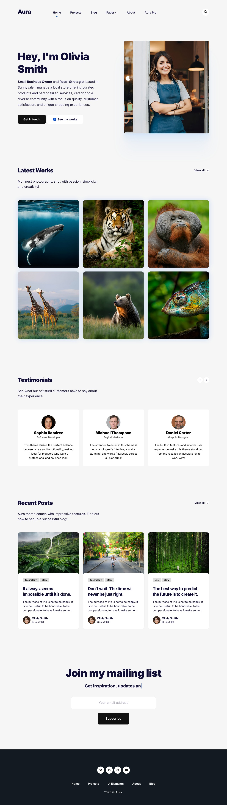

	
# Aura Jekyll Theme
	
Versatile Jekyll theme designed for content creators, writers, and developers!

[Aura Demo](https://satishw.github.io/jekyll-theme-aura) &nbsp; | &nbsp; [AuraPro Demo](https://satishw.github.io/jekyll-theme-aura-pro/features) &nbsp; | &nbsp; [Download AuraPro](https://satishw.github.io/jekyll-theme-aura-pro/features) &nbsp; | &nbsp; [Buy me a coffee](https://www.paypal.com/donate/?hosted_button_id=UHZSDZ9A9CVLE)  

  
It’s an ideal solution for personal websites, blogs, small business sites, or simple project site can be hosted on platforms like GitHub Pages, Netlify, Cloudflare Pages, or your own server. 

This theme is a fork of the [Vonge theme](https://github.com/CloudCannon/vonge-jekyll-bookshop-template) developed by CloudCannon. Unlike Vonge, Aura is fully compatible with GitHub Pages.

## Theme Screenshot

## Features
- Works with GitHub Pages (Free hosting)
- Responsive design
- Blog section
- Projects Section
- Testimonials section
- Tag pages
- Scroll to top button
- Color Infoboxes
- Table of Content
- FAQ on any post or page
- Code highlight
- Image gallery
- Image lazy loading
- Embed Youtube videos
- Social sharing
- Logo support
- Supports contact form (Formspree)
- Supports MailChimp newsletter
- Supports Disqus comments
- Supports Google Analytics
- Optimized for mobile devices
- Compatible with modern browsers
- Fast performance
- Free updates and support!

## Installing Jekyll on Local System

Jekyll requires Ruby - the [official Ruby site](https://www.ruby-lang.org/en/downloads/) has instructions for installation. Jekyll is installed using this command in the terminal:

	gem install jekyll bundler

Next you'll need to clone the [Github repository](https://github.com/satishw/jekyll-theme-aura) to your machine.

	git clone https://github.com/satishw/jekyll-theme-aura.git

From the root directory install all the dependencies with:

	bundle install

And then run Jekyll with:

	bundle exec jekyll serve

The site can now be accessed from `http://localhost:4000/` in your web browser.

To run the validation suite:

	bundle exec jekyll build && htmlproofer --disable-external --check-html ./_site

## Credits
Special thanks to [Vonge theme](https://github.com/CloudCannon/vonge-jekyll-bookshop-template) developer CloudCannon, Aura Jekyll theme is fork of that. I would also like to thank to [Mediumish](https://github.com/wowthemesnet/mediumish-theme-jekyll), and [minimal mistakes](https://github.com/mmistakes/minimal-mistakes) from which some features of this theme are inspired.

## License
The MIT License (MIT)

